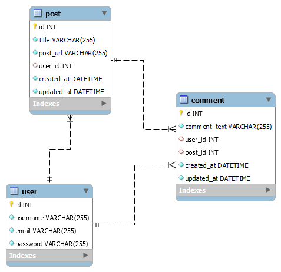

# Tech Blog

## This is a web application for users to post their thoughts on all things about hiking trails. The app is located on Heroku at [https://takea-hike.herokuapp.com/](https://takea-hike.herokuapp.com/).

## Table of Contents:

- [Installation](#installation)
- [Usage](#usage)
- [Screenshots](#screenshots)
- [License](#license)
- [Collaborators](#collaborators)
- [Contributing](#contributing)
- [Testing](#tests)
- [Questions](#questions)

## Installation

Clone the repository from [GitHub](https://github.com/willig0203/fantastic-umbrella) onto your machine in a local folder if you want to run it locally.

## Usage

Step 1: From the terminal in vsCode type `npm install`,
Step 2: Run the `db schema.sql` to create the database schema,
Step 3: Force sync database to `true` (this will create the tables and relationships between the tables when server runs for the first time),
Step 4: Enter `node server.js` to start the server and then stop the server.
Step 5: Force sync database to `false` (this will stop seed from being overwritten),
Step 6: Seed the database by running the `npm run seeds script`,
Step 7: Enter `node server.js` to start the server,
Step 8: Enter localhost:3001 in your browser.

OR

Use the live app on Heroku: [https://taka-hike.herokuapp.com/](https://takea-hike.herokuapp.com/)

## Screenshots

|        <b>Image running on a computer</b>        |
| :----------------------------------------------: |
|  |

<!-- |         <b>Image running on a mobile device</b>          |
| :------------------------------------------------------: |
|  | -->

## License

&copy; 2022 by Gary Williams (Trademark GarywareLLC).
This project is licensed under the MIT license.
https://opensource.org/licenses/MIT

## Collaborators:

Gary Williams

## Contributing

None at this time.

## Tests

None at this time.

## Questions

Contact Gary Williams at: [willig0203@gmail.com](mailto:willig0203@gmail.com)
